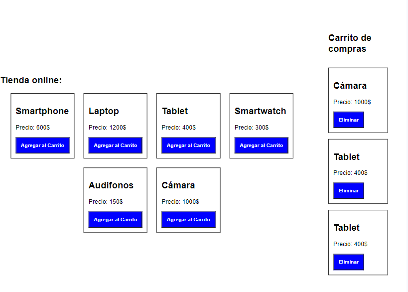
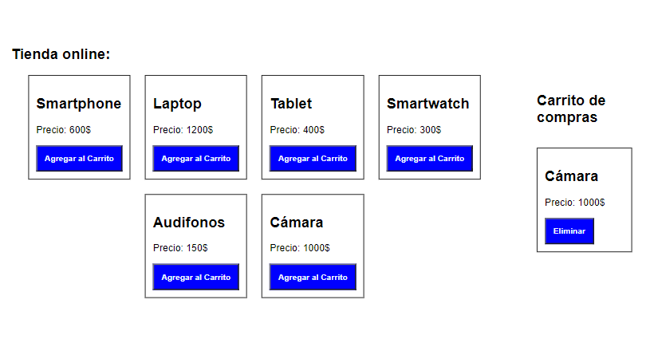
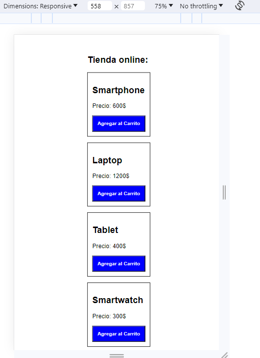

# Ejercício React Carrito de la compra

## Ejercicio creado en vite
## Permite agregar y eliminar productos del carrito de la compra
## Se hace una petición mediante fetch para recoger los datos de un json
## Responsive design mediante flex

